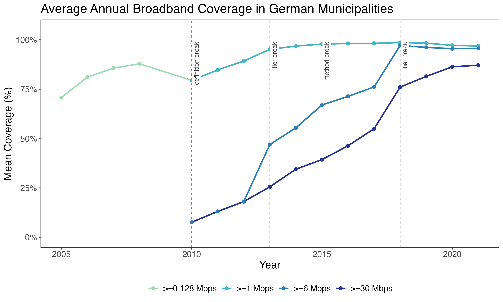
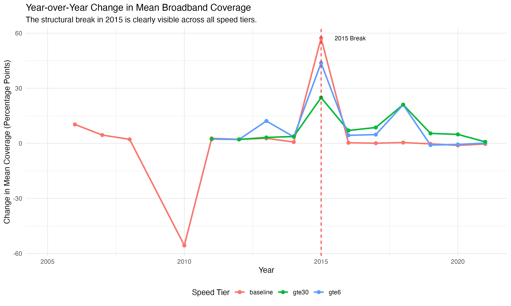
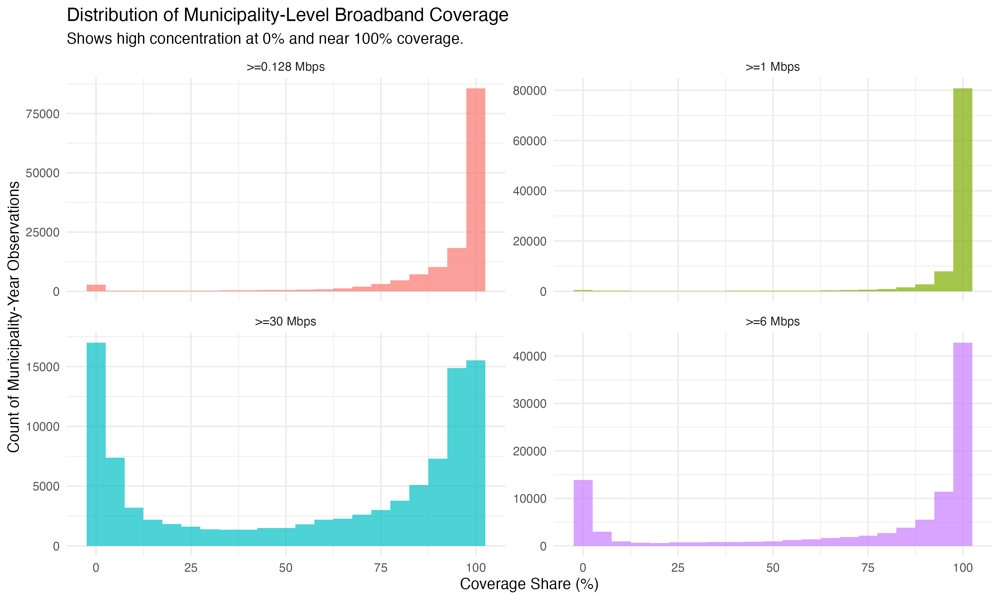

# Descriptive analysis of harmonized broadband data

This document provides a brief descriptive overview of the harmonized German municipal broadband panel dataset (2005-2021).

## Data quality notes

### Use with caution

This dataset has known limitations that users should be aware of:

1. **Methodological breaks**: Two major breaks (2010, 2015) affect comparability across years
2. **Missing years**: 2009-2017 have limited data availability
3. **Filtered observations**: ~3.9% of observations filtered due to unmapped AGS codes (see [unmapped_ags_documentation.md](unmapped_ags_documentation.md) for details)

### If using prior data

If you previously used this dataset, please re-download. Fixes include:

- 2005-2008 baseline coverage now correctly populated (~82% mean, was 0%)
- All values validated to [0, 100] range
- AGS codes validated against official Destatis 2021 reference

## Discontinuous changes in the data

The panel data is constructed from historical sources with changing methodologies. This results in two  "breaks" in the time series that users must be aware of.

### The 2009/2010 break

To create a continuous series for basic internet availability, the `share_broadband_baseline` variable was constructed from two different underlying sources:

- **For 2005-2008**: The variable is based on historical DSL availability data (`speed_mbps_gte = 0`, representing >=0.128 Mbps).
- **For 2009**: The variable blends historical and modern data sources.
- **From 2010 onwards**: The variable is based on >=1 Mbps coverage. Since >=1 Mbps implies >=0.128 Mbps, this is a lower bound on basic access.

**The consequence is a "jump" in the data where the definition of the baseline metric changes.** This is visible in the plots as a sharp jump between 2008 and 2010, when the data source switches. This is distinct from organic growth.

### The 2015 break

As noted in the project documentation, 2015 marks a major structural break due to a change in the primary data provider and reporting standards. This affects all speed tiers and is visible as a very large, discontinuous jump in coverage levels. The `method_change_2015` dummy variable is included in the dataset to allow researchers to control for this event.

---

## Descriptive plots

### Average annual coverage

This plot shows the mean coverage for the baseline metric alongside higher speed tiers. The two key events are clearly visible: the **2010 jump** where the baseline definition changes, and the massive **2015 methodological break**.

### Year-over-year change in coverage

This plot highlights the magnitude of the two breaks. The jump in `baseline` coverage between 2008 and 2010 is substantial. However, it is dwarfed by the massive spike across all speed tiers in 2015.

### Distribution of coverage levels

This set of histograms shows the distribution of coverage values. The `share_broadband_baseline` is heavily skewed towards 100%, indicating that most municipalities achieved full basic coverage relatively early. In contrast, higher speed tiers show more variation and a larger concentration near 0%.

